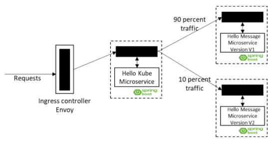

# Istio

## Overview
- The term service mesh is used to describe the network of microservices that make up such applications and the interactions between them.
- A service mesh has more complex operational requirements as below:
  - Service Discovery
  - Load Balancing
  - Failure Recovery
  - Metrics
  - Monitoring
  - A/B testing
  - Canary Releases
  - Rate Limiting
  - Access Control
  - End-to-end Authentication
- Istio provides behavioral insights and operational control over the service mesh as a whole. Its key features are given below:
  - **Traffic Management:** Control the flow of traffic and API calls between services.
  - **Observability:** Gain understanding of the dependencies between services and the nature and flow of traffic between them
  - **Policy Enforcement:** Apply organizational policy to the interaction between services.
  - **Service Identity and Security:** Provide services identity and the ability to protect service traffic as it flows over networks.
  - **Integration and Customization:** The policy enforcement component can be extended and customized to integrate with existing solutions for ACLs, logging, monitoring, quotas, auditing and more.
- Istio service mesh is logically split into
  - **Data Plane:**
    - It is composed of a set of intelligent proxies (**Envoy**) deployed as sidecars. 
    - These proxies mediate and control all network communication between microservices.
  - **Control Plane:**
    - Manages and configures the proxies to route traffic.
    - **Istiod** 
      - Provides service discovery, configuration and certificate management.
      - Istiod converts high level routing rules that control traffic behavior into Envoy-specific configurations, and propagates them to the sidecars at runtime.
        - **Pilot** provides service discovery for the Envoy sidecars, traffic management capabilities for intelligent routing (A/B tests, canary deployments), and resiliency (timeouts, retries, circuit breakers).
        - **Citadel** provides strong service-to-service and end-user authentication with built-in identity and credential management.
        - **Galley** provides configuration validation, ingestion, processing, and distribution component.
    
      

- **Istioctl** is configuration command line utility of Istio. It helps to create, list, modify and delete configuration resources in the Istio system.

## Installation
- Istio Installation Steps   
  ```sh
  # Download Software
  curl -L https://istio.io/downloadIstio | sh -
  cd istio*
  export PATH=$PWD/bin:$PATH
  echo 'export PATH=~/istio*/bin:$PATH' >> ~/.bashrc

  # Installation Pre-Check
  istioctl x precheck

  # List Profiles
  istioctl profile list

  # Installing Istio with demo configuration profile
  istioctl install --set profile=demo -y
  istioctl install --set revision=<revision>

  # Generate Istio Profile
  istioctl manifest generate --set profile=demo >> istio.yaml
  kubectl apply -f istio.yaml

  # Addons
  kubectl apply -f samples/addons/prometheus.yaml
  kubectl apply -f samples/addons/grafana.yaml
  kubectl apply -f samples/addons/jaeger.yaml
  kubectl apply -f samples/addons/kiali.yaml

  # Upgrade Istio
  istioctl upgrade

  # Auto enable Istio on default namespace 
  kubectl label namespace default istio-injection=enabled
  kubectl get namespace -L istio-injection

  # Validate
  istioctl verify-install
  kubectl get crds
  kubectl get crds | grep 'istio.io\|certmanager.k8s.io' | wc -l
  kubectl get svc -n istio-system
  kubectl get pods -n istio-system

  # Dashboard
  istioctl dashboard
  istioctl dashboard kiali
  ```

## Module
- Canary Release Example
  - **Example 1: HelloWorld**
    ```sh
    # Below files available in MyDev Folder

    # Create Istio HelloWorld containing Deployments, Service,  Gateway & VirtualService
    # curl -L -s https://raw.githubusercontent.com/rahgadda/  Kubernetes/master/MyDev/helloworld.yaml | kubectl apply -f -
    kubectl apply -f helloworld.yaml -n default

    # Get SVC Details
    kubectl get svc
    kubectl get svc -n istio-system
    kubectl get svc -n istio-system -l app=istio-ingressgateway

    # Get Istio Proxy Status
    istioctl ps

    # Get Ingress Port Mapping
    export INGRESS_PORT=$(kubectl -n istio-system get service   istio-ingressgateway -o jsonpath='{.spec.ports[?(@. name=="http2")].nodePort}')

    # Test URL curl http://$URL:$INGRESS_PORT/hello
    ```
  - **Example 2: Welcome**
    

    ```sh
    # Spring Project flow HelloKube (docker: pmusale/ istiocanary) -> HelloService (docker: pmusale/kubecanary v1, v2)
    # Below files available in MyDev Folder  

    # Create istiocanary i.e HelloKube
    # curl -L -s https://raw.githubusercontent.com/rahgadda/Kubernetes/master/MyDev/kube-canary-app.yaml | kubectl  apply -f -
    kubectl apply -f kube-canary-app.yaml -n default

    # Create kubecanary i.e HelloService v1 & v2
    # curl -L -s https://raw.githubusercontent.com/rahgadda/Kubernetes/master/MyDev/hello-message-app.yaml | kubectl  apply -f -
    kubectl apply -f hello-message-app.yaml -n default

    # Configure Istio Gateway, VirtualService & Destination Rule
    # curl -L -s https://raw.githubusercontent.com/rahgadda/Kubernetes/master/MyDev/istio-config.yaml | kubectl apply -f -
    kubectl apply -f istio-config.yaml

    # Get SVC Details
    kubectl get svc
    kubectl get svc -n istio-system
    kubectl get svc -n istio-system -l app=istio-ingressgateway

    # Get Istio Proxy Status
    istioctl ps

    # Test URL curl http://$URL:$INGRESS_PORT/welcome
    # Script to print
    vi test.bash

    #!/bin/bash
    
    INGRESS_PORT=`kubectl -n istio-system get service istio-ingressgateway -o jsonpath='{.spec.ports[?(@.name=="http2")].nodePort}'`
    
    for i in {1..100}
    do
      echo $i `curl -s http://localhost:$INGRESS_PORT/welcome`
    done

    # Running Test File
    source test.bash
    ```
    
  - **Example 3: Telemetrics**
    ```sh
    istioctl dashboard grafana
    kubectl port-forward -n istio-system --address 0.0.0.0 3000:3000
    
    istioctl dashboard jaeger
    istioctl dashboard kiali
    istioctl dashboard prometheus
    ```
## Reference
- [Installation](https://istio.io/latest/docs/setup/getting-started/)